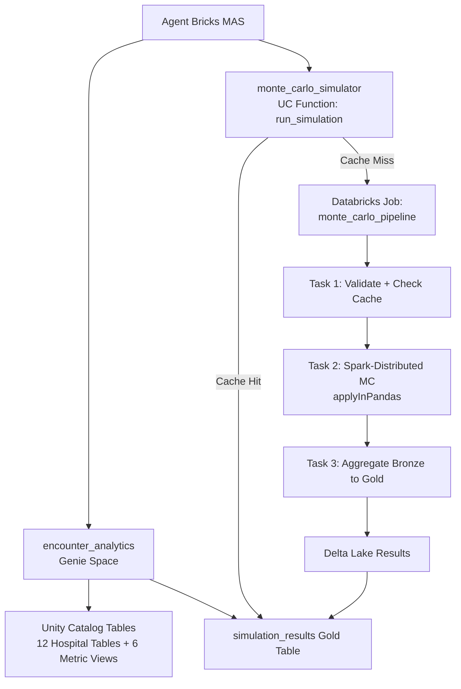

<div align="center">
  <a href="https://www.databricks.com/">
    
  </a>
  <h1>Hospital Monte Carlo Supervisor</h1>
  <p><strong>Unify hospital analytics with Monte Carlo simulation through a single AI supervisor.</strong></p>
</div>

---

## Overview

Hospital systems today rely on separate tools for different analytical needs: BI dashboards for historical reporting, spreadsheets for forward-looking projections, and manual processes to bridge the two. When an operations director asks "What was our ER volume last quarter?" they open one tool. When they follow up with "What will it be next quarter if we add 50 beds?" they switch to a completely different workflow. There is no unified interface that handles both retrospective analytics and probabilistic forecasting in a single conversation.

This solution accelerator demonstrates a fully **Databricks-native** approach that combines three platform capabilities into one conversational experience. A **Genie Space** provides natural-language analytics over synthetic hospital encounter data backed by **UC Metric Views** as a semantic layer. A **Monte Carlo simulation engine** runs Spark-distributed probabilistic forecasts using `applyInPandas`, writing results to Delta Lake in a Bronze-to-Gold medallion architecture. An **Agent Bricks Multi-Agent Supervisor (MAS)** orchestrates between the two, automatically routing historical data questions to Genie and forward-looking simulation requests to a UC Function that triggers parameterized Databricks Jobs.

The result is a single AI endpoint where users can ask questions like "Show me ER encounters by month" and "Forecast ER volumes for the next 90 days" in the same conversation, with the supervisor handling decomposition, routing, and response synthesis transparently.

---

## Architecture

```
+-------------------------------------------------------------+
|  Agent Bricks Multi-Agent Supervisor                        |
|  +---------------------------+  +------------------------+  |
|  | encounter_analytics       |  | monte_carlo_simulator  |  |
|  | (Genie Space)             |  | (UC Function)          |  |
|  | - Encounter data          |  | - run_simulation()     |  |
|  | - Metric Views            |  | - Cache check          |  |
|  | - Simulation Gold results |  | - Trigger Job          |  |
|  +---------------------------+  +------------------------+  |
+-------------------+---------------------+-------------------+
                    |                     |
                    v                     v
+-------------------+---+   +-------------+-------------------+
| Unity Catalog         |   | Databricks Job:                 |
| - 12 Hospital Tables  |   |   monte_carlo_pipeline          |
| - 6 Metric Views      |   | Task 1: Validate + check cache  |
| - Simulation Results  |   | Task 2: Spark-distributed MC    |
+-----------------------+   |         (applyInPandas)          |
                            | Task 3: Aggregate Bronze -> Gold |
                            +-------------+-------------------+
                                          |
                                          v
                            +-------------+-------------------+
                            | Delta Lake Results Tables       |
                            | - simulation_runs   (metadata)  |
                            | - simulation_trials (Bronze)    |
                            | - simulation_results (Gold)     |
                            +---------------------------------+
```



---

## Key Components

### Synthetic Hospital Data

Twelve tables of deterministic, seeded synthetic data representing a three-year hospital dataset (2022-2024):

- **25,000 patients** with demographics, insurance types, and chronic conditions
- **120,000 encounters** across Emergency, Inpatient, Outpatient, and Observation types
- **180,000 diagnoses**, **90,000 procedures**, and **120,000 billing records**
- Realistic distributions: bimodal age, seasonal encounter spikes (flu season Nov-Feb), weekday/weekend ER patterns, payer-specific reimbursement rates, and an 8% claim denial rate

All data is generated with `numpy.random.default_rng(seed=42)` for full reproducibility. Pre-generated CSV files are committed to `/data/` for inspection.

### UC Metric Views

Six semantic metric views defined using native Databricks `CREATE VIEW ... WITH METRICS LANGUAGE YAML`:

| Metric View | Source | Key Measures |
|---|---|---|
| `mv_encounter_summary` | encounters | Total Encounters, Avg LOS, Median LOS, Unique Patients |
| `mv_revenue_by_payer` | billing + encounters | Total Revenue, Avg Reimbursement Rate, Denial Rate |
| `mv_readmission_rates` | encounters + readmissions + diagnoses | Readmission Count, 30-Day Readmission Rate, Avg Days to Readmission |
| `mv_daily_census` | encounters (inpatient) | Daily Admissions, Avg LOS, Total Bed Days |
| `mv_department_throughput` | encounters + procedures | Patient Volume, Procedure Count, Procedures per Encounter |
| `mv_patient_demographics` | patients + encounters | Patient Count, Encounters per Patient, Avg Age |

Each metric view is a first-class Unity Catalog securable object that Genie Spaces natively consume.

### Monte Carlo Simulation Engine

Five simulation types powered by Spark-distributed `applyInPandas` execution:

| Simulation Type | Model | Distributions |
|---|---|---|
| `patient_volume` | Monthly encounter forecasting | Normal with growth factor and seasonal sine wave |
| `revenue` | Per-encounter revenue modeling | Normal charges with Beta-distributed denial rates |
| `length_of_stay` | LOS distribution by department | Log-normal with department-specific parameters |
| `readmission_rate` | 30-day readmission probability | Binomial with department-specific base rates |
| `ed_wait_time` | ED wait times by hour of day | Gamma with peak-hour multipliers |

Default configuration: 10,000 trials distributed across 50 Spark partitions with deterministic seeding per batch.

### Genie Space

A natural-language analytics interface configured with all 12 hospital tables, 6 metric views, and the simulation Gold results table. Users ask questions in plain English; Genie translates them to SQL using the metric view semantic layer for consistent KPI definitions.

### Agent Bricks Multi-Agent Supervisor

A declarative MAS with two sub-agents:

- **encounter_analytics** (Genie Space): Handles historical data questions and queries over previously-run simulation results
- **monte_carlo_simulator** (UC Function): Triggers new Monte Carlo simulations or retrieves cached results

The supervisor automatically routes based on query intent, supports compound queries (historical lookup followed by simulation), and synthesizes multi-agent responses.

---

## Quick Start

### Prerequisites

- Databricks workspace with Unity Catalog enabled
- Databricks CLI v0.280+ (`databricks version`)
- SQL Warehouse (serverless recommended)
- Python 3.10+

### Setup

```bash
# 1. Clone the repository
git clone <repo-url>
cd monte-carlo-supervisor

# 2. Install Python dependencies
make install

# 3. Authenticate with your Databricks workspace
databricks auth login --host <your-workspace-url> --profile my-workspace

# 4. Deploy Databricks Asset Bundle
DATABRICKS_CONFIG_PROFILE=my-workspace databricks bundle deploy

# 5. Run the setup pipeline (creates tables, views, functions, Genie Space, MAS)
#    If using an existing catalog, pass it as a parameter:
databricks api post /api/2.1/jobs/run-now --profile my-workspace --json '{
  "job_id": <setup_pipeline_job_id>,
  "job_parameters": {
    "catalog": "your_catalog",
    "schema": "hospital_data"
  }
}'
```

The setup pipeline runs 7 tasks automatically:

| Task | Purpose |
|---|---|
| `setup_catalog` | Create Unity Catalog catalog and schema |
| `load_data` | Load CSV files into UC tables |
| `create_metric_views` | Register 6 UC Metric Views |
| `create_sim_tables` | Create simulation_runs, simulation_trials, simulation_results tables |
| `register_functions` | Register `check_simulation` and `trigger_simulation` UC Functions |
| `configure_genie` | Create and configure Genie Space |
| `create_supervisor` | Create Agent Bricks MAS |

### Verify

Test the MAS endpoint via AI Playground or REST API with these sample queries:

```
"Show me total ER encounters by month for 2024"
"Forecast ER patient volumes for the next 90 days"
"What was readmission rate last year, and simulate what happens with 15% LOS reduction?"
```

---

## Demo Walkthrough (Talk Track)

This section provides a structured 6-scene demo narrative. Each scene builds on the previous one, progressing from simple historical queries to compound analytics-plus-simulation requests. See [docs/talk_track.md](docs/talk_track.md) for the full presenter guide.

### Scene 1: Historical Volume Trends (Genie)

> **Ask:** "Show me total ER encounters by month for 2024"

The supervisor routes to the Genie Space, which queries `mv_encounter_summary` filtered to Emergency encounters. Returns a monthly trend showing seasonal patterns (higher volumes in winter months).

### Scene 2: Clinical KPI Lookup (Genie)

> **Ask:** "What's our average length of stay for cardiac patients?"

Routes to Genie, which joins encounters with diagnoses filtered to cardiology-related ICD-10 codes. Demonstrates the metric view semantic layer returning consistent LOS calculations.

### Scene 3: Forward-Looking Forecast (Monte Carlo)

> **Ask:** "Forecast ER patient volumes for the next 90 days"

Routes to the `run_simulation` UC Function with `simulation_type='patient_volume'`. The function checks the cache, triggers a Databricks Job if needed, and returns percentile distributions (p10/p25/p50/p75/p90) of projected daily volumes.

### Scene 4: What-If Capacity Analysis (Monte Carlo)

> **Ask:** "What if we add 50 beds -- what's our overflow probability?"

Routes to `run_simulation` with `simulation_type='capacity'` and `additional_beds=50`. The simulation models Poisson admissions against bed capacity to estimate overflow probability across the forecast horizon.

### Scene 5: Revenue Scenario Modeling (Monte Carlo)

> **Ask:** "Compare projected revenue if we shift 10% of Medicare to managed care"

Routes to `run_simulation` with `simulation_type='revenue'` and a payer mix shift parameter. Models the revenue impact of changing the payer mix using per-encounter log-normal revenue distributions with payer-specific reimbursement rates.

### Scene 6: Compound Query (Genie then Monte Carlo)

> **Ask:** "What was readmission rate last year, and simulate what happens with 15% LOS reduction?"

The supervisor decomposes this into two steps:
1. Routes to Genie for the historical 30-day readmission rate from `mv_readmission_rates`
2. Routes to `run_simulation` with `simulation_type='length_of_stay'` and `los_reduction_pct=0.15`
3. Synthesizes both results, showing the baseline vs. projected impact

---

## Data Model

All tables reside in `{catalog}.{schema}` (default: `monte_carlo_sim.hospital_data`).

### Dimension Tables

| Table | ~Rows | Key Columns |
|---|---|---|
| `patients` | 25,000 | patient_id, date_of_birth, gender, zip_code, insurance_type, chronic_conditions |
| `providers` | 500 | provider_id, name, specialty, facility_id, npi |
| `facilities` | 15 | facility_id, name, type, bed_count, city, state |

### Fact Tables

| Table | ~Rows | Key Columns |
|---|---|---|
| `encounters` | 120,000 | encounter_id, patient_id, provider_id, facility_id, encounter_type, admission_date, discharge_date, length_of_stay, department |
| `diagnoses` | 180,000 | diagnosis_id, encounter_id, icd10_code, is_primary |
| `procedures` | 90,000 | procedure_id, encounter_id, cpt_code, procedure_date |
| `billing` | 120,000 | billing_id, encounter_id, total_charges, allowed_amount, paid_amount, payer_id, claim_status, patient_responsibility |
| `readmissions` | ~8,000 | readmission_id, original_encounter_id, readmit_encounter_id, days_between |

### Reference Tables

| Table | ~Rows | Purpose |
|---|---|---|
| `icd10_codes` | ~500 | ICD-10 diagnosis code lookup |
| `cpt_codes` | ~300 | CPT procedure code lookup |
| `payers` | ~10 | Insurance payer reference |
| `departments` | ~20 | Department names and metadata |

### Simulation Result Tables

| Table | Purpose | Key Columns |
|---|---|---|
| `simulation_runs` | Run metadata + cache index | run_id, simulation_type, parameters, params_hash, seed, num_simulations, status, job_run_id, created_at |
| `simulation_trials` | Bronze: raw trial outcomes | run_id, batch_id, trial_id, simulated_* columns (type-specific) |
| `simulation_results` | Gold: aggregated percentiles | run_id, simulation_type, metric_name, group_key, group_value, mean_value, std_value, p05-p95, num_trials |

See [docs/data_model.md](docs/data_model.md) for complete column descriptions and relationships.

---

## Configuration Reference

### Environment Variables (.env)

| Variable | Description | Example |
|---|---|---|
| `DATABRICKS_HOST` | Workspace URL | `https://adb-xxxx.azuredatabricks.net` |
| `DATABRICKS_TOKEN` | Personal access token | `dapi...` |
| `UC_CATALOG` | Unity Catalog name | `monte_carlo_sim` |
| `UC_SCHEMA` | Schema name | `hospital_data` |
| `MC_JOB_ID` | Monte Carlo pipeline job ID (set after deploy) | `123456789` |
| `GENIE_SPACE_ID` | Genie Space ID (set after creation) | `01ef...` |
| `DATA_SEED` | Random seed for data generation | `42` |

### Make Targets

| Target | Description |
|---|---|
| `make help` | Show all available targets |
| `make setup` | Create `.env` from `.env.example` |
| `make install` | Install Python dependencies (`pip install -e ".[dev]"`) |
| `make generate-data` | Regenerate synthetic data CSVs to `/data/` |
| `make deploy` | Deploy Databricks Asset Bundle (set `DATABRICKS_CONFIG_PROFILE` first) |
| `make deploy-dev` | Deploy to dev target |
| `make deploy-prod` | Deploy to prod target |
| `make test` | Run pytest test suite |
| `make lint` | Run ruff linter |
| `make format` | Auto-format code with ruff |
| `make clean` | Remove caches and build artifacts |

---

## Project Structure

```
monte-carlo-supervisor/
├── README.md
├── Makefile
├── pyproject.toml
├── requirements.txt
├── .env.example
│
├── data/                                  # Pre-generated synthetic CSV files
│   ├── patients.csv
│   ├── providers.csv
│   ├── facilities.csv
│   ├── encounters.csv
│   ├── diagnoses.csv
│   ├── procedures.csv
│   ├── billing.csv
│   ├── readmissions.csv
│   ├── icd10_codes.csv
│   ├── cpt_codes.csv
│   ├── payers.csv
│   └── departments.csv
│
├── docs/
│   ├── architecture.md                    # Component deep-dive and diagrams
│   ├── talk_track.md                      # Structured demo narrative
│   ├── data_model.md                      # ERD and table descriptions
│   └── simulations.md                     # Monte Carlo methodology
│
├── infra/                                 # Databricks Asset Bundle
│   ├── databricks.yml
│   ├── resources/
│   │   ├── catalog.yml
│   │   ├── jobs.yml
│   │   └── permissions.yml
│   └── variables/
│       ├── dev.tfvars.json
│       └── prod.tfvars.json
│
├── notebooks/
│   ├── setup/                             # Run once to initialize
│   │   ├── 00_setup_catalog.py
│   │   ├── 01_generate_synthetic_data.py
│   │   ├── 02_create_metric_views.py
│   │   ├── 03_register_mc_functions.py
│   │   ├── 04_create_simulation_tables.py
│   │   ├── 05_configure_genie_space.py
│   │   └── 06_create_supervisor.py
│   └── jobs/                              # MC simulation pipeline tasks
│       ├── mc_01_validate.py
│       ├── mc_02_simulate.py
│       └── mc_03_aggregate.py
│
├── src/
│   ├── databricks/
│   │   ├── synthetic_data/                # Data generation
│   │   │   ├── config.py
│   │   │   ├── generators/
│   │   │   │   ├── patients.py
│   │   │   │   ├── providers.py
│   │   │   │   ├── encounters.py
│   │   │   │   ├── diagnoses.py
│   │   │   │   ├── procedures.py
│   │   │   │   ├── billing.py
│   │   │   │   └── reference_data.py
│   │   │   └── loader.py
│   │   │
│   │   ├── metric_views/                  # UC Metric View definitions
│   │   │   └── definitions.py
│   │   │
│   │   ├── monte_carlo/                   # MC simulation engine
│   │   │   ├── engine.py                  # applyInPandas distributed engine
│   │   │   ├── results.py                 # Bronze/Gold writers + cache
│   │   │   └── models/                    # Simulation model files
│   │   │
│   │   ├── sql/functions/monte_carlo/     # UC Function definitions
│   │   │   ├── run_simulation.py
│   │   │   └── registry.py
│   │   │
│   │   ├── genie/                         # Genie Space configuration
│   │   │   ├── space_config.py
│   │   │   └── sample_questions.py
│   │   │
│   │   └── agentbricks/                   # Agent Bricks MAS
│   │       ├── supervisor.py
│   │       └── examples.py
│   │
│   └── utils/
│       └── config.py                      # Environment config loader
│
└── tests/
    ├── test_synthetic_generators.py
    ├── test_mc_functions.py
    └── test_supervisor_config.py
```

---

## License

See [LICENSE.md](LICENSE.md) for details.

---

&copy; 2025 Databricks, Inc. All rights reserved. The source in this repository is provided subject to the [Databricks License](https://databricks.com/db-license-source). All included or referenced third party libraries are subject to the licenses set forth below.
